 # Tutorial
 ## Main Screen

* Match  
Matchmaking feature, it will match you with some other user who has approximately the same score as you (+-5)
* Web game  
It is used to play with your friends. One of you created the game and the other connects to it
* Local game  
The same as Web game but on local network (Wi-fi) (not recommended to use it when you have network access, better to use Web game)  
On some networks it does not work, on some searching for hosts takes to long, so just use Web game
* Non-network game  
Game on one device
* Settings  
Login, register, account and battles managements and leaderboard
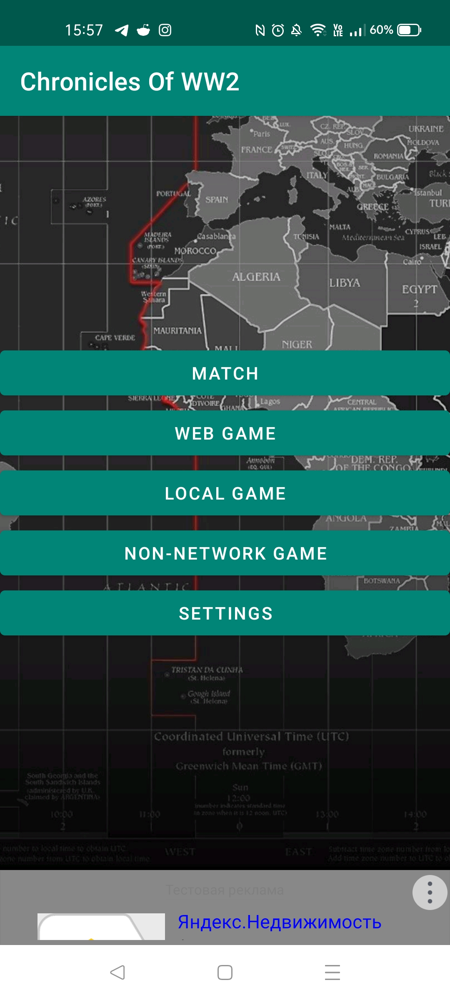

## Playing with friends
Here you can choose to join the game, or to create the game   
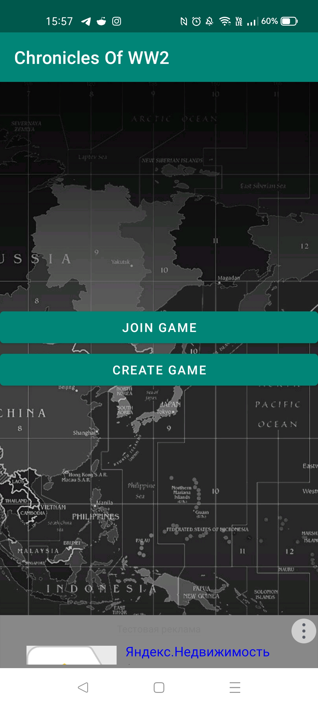  
### Create game

<table>
  <tr>
    <td>
      
Here you can create the game
  
      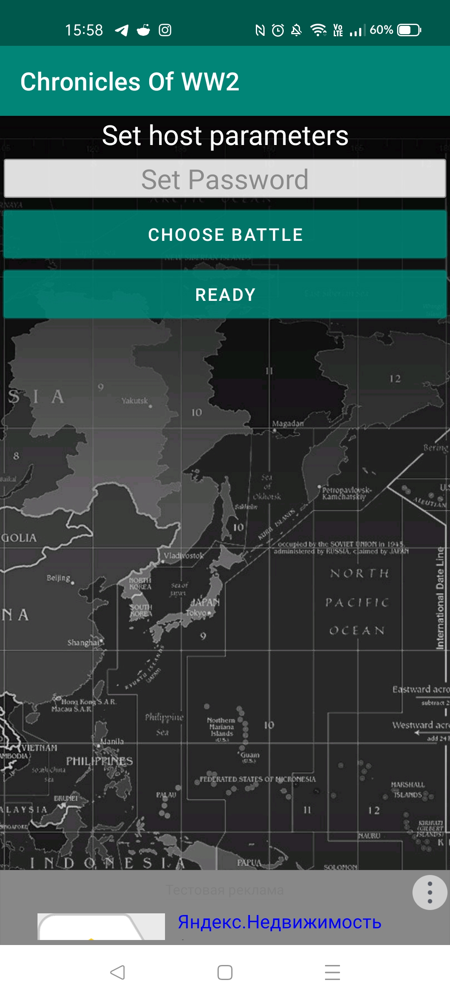 
    </td>
      <td>
        
You need to choose battle to create game
  
        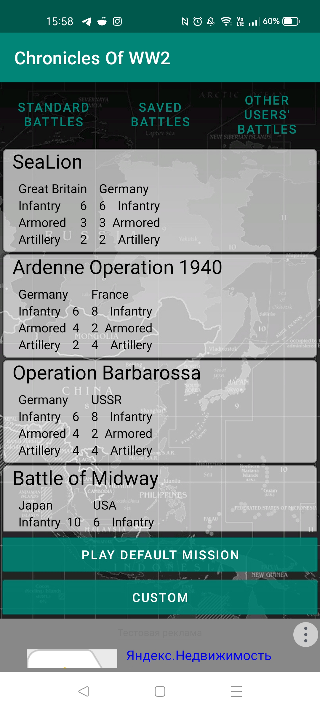  
      </td>
    </tr>
    <tr>
      <td>
        
After it you can see settings for your game, board size, who will play what nation, etc.
  
        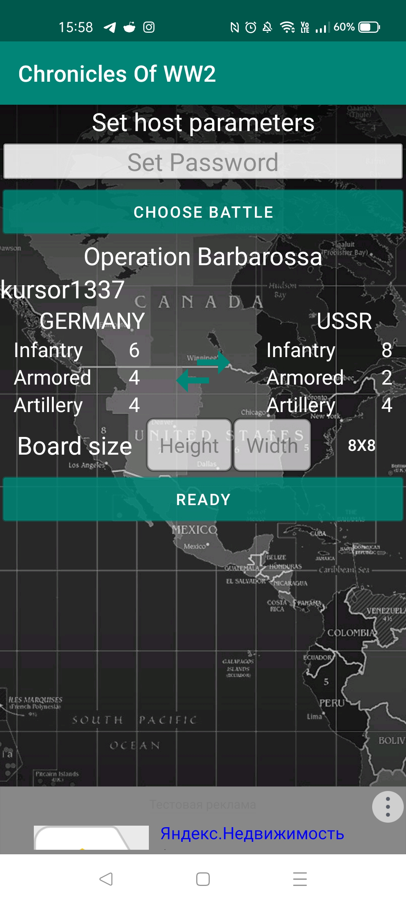 
      </td>
      <td>
      

        Press "Ready" to create the game  
        You will see the game id, tell it your friend, so he/she can connect to the right game  
      

      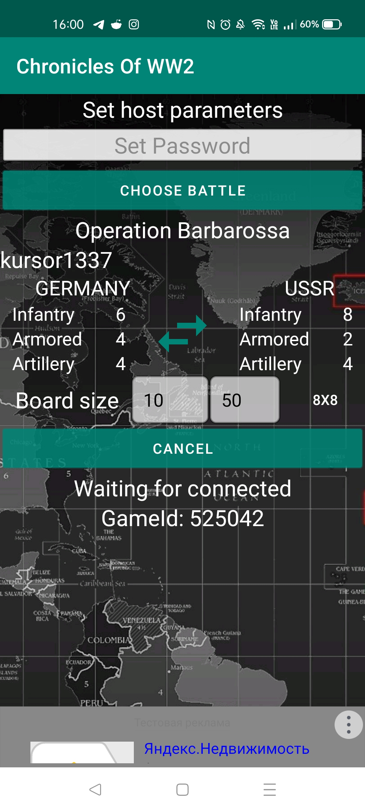  
    </td>
  </tr>
</table>

 

 

When your friend will try to connect to your game you will see the connection request on your screen  
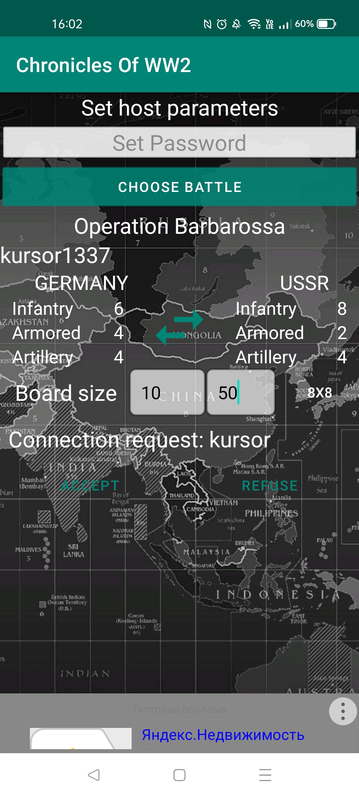  

### Join game
Joining the game is much easier than creating it. You just need to choose what game to connect  
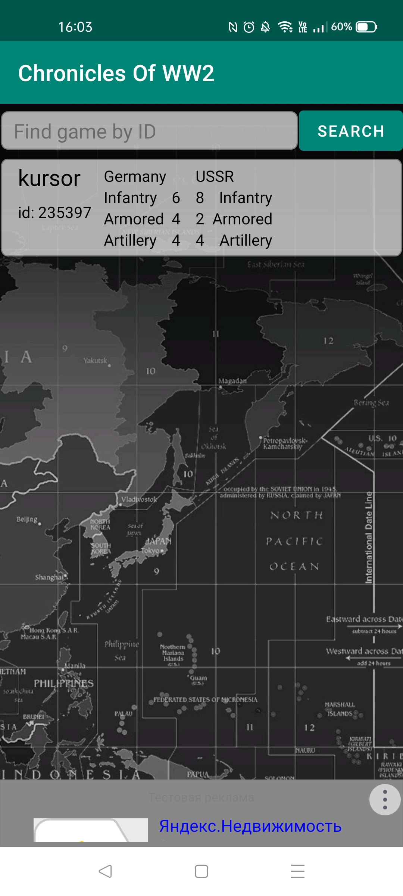  

## Game mechanics

First, you can move divisions from your reserves to your frontline (from bottom buttons to the game board)
When you attack other player's divisions you not eat then, instead you decrease their hp  
To win you need to kill all enemy's divisions, or place one of your divisions in his first row

The game has three different types of divisions  
* Infantry  
* Armored  
* Artillery  

Lets see how they differ  

### Infantry
<table>
  <tr>    
    <td>
      

        Infantry divisions can move like a king in chess.  
        One tile vertically, horizontally or diagonally
      
 
      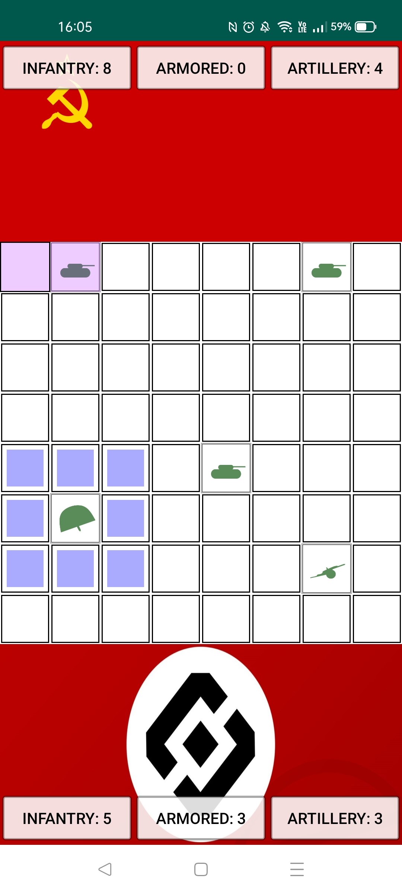  
    </td>
    <td>
      
They attack the same as they move

      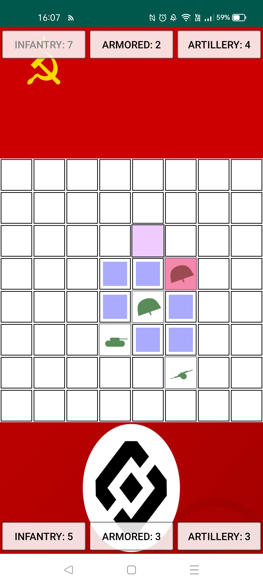  
    </td>
  </tr>
</table>

### Armored
<table>
  <tr>
    <td>
      

        Armored divisions are very fast, so they can move 2 tiles
        vertically or horizontally and 1 tile diagonally
      

      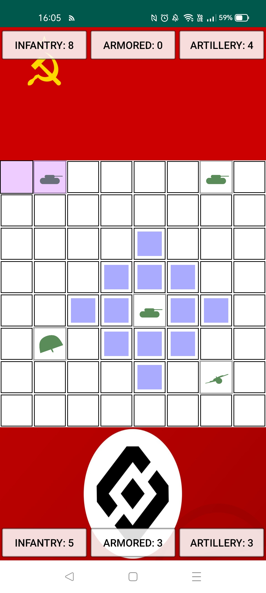
    </td>
    <td>
      
However, they can attack only one tile from them, excluding diagonally
  
      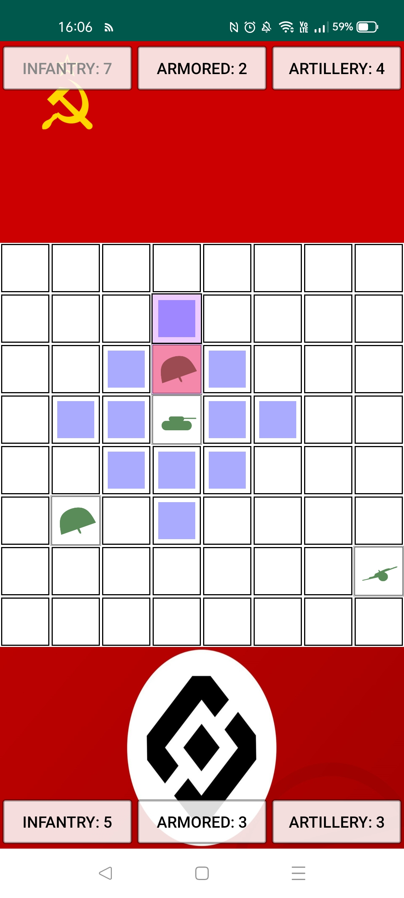
    </td>
  </tr>
</table>

  
  
### Artillery
Artillery divisions are very slow, but they can attack on long distances  
They move just like Armored divisions attack,  
only one tile from them, excluding diagonally  
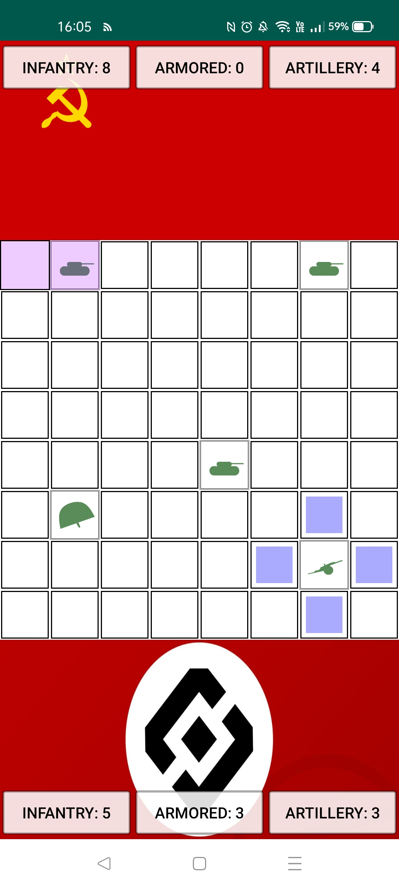  
But they can shoot very far, 3 tiles from them on the line, and 2 + 1 on the diagonal  
The formula is abs(x + y) < 3  
<table>
  <tr>
    <td>
      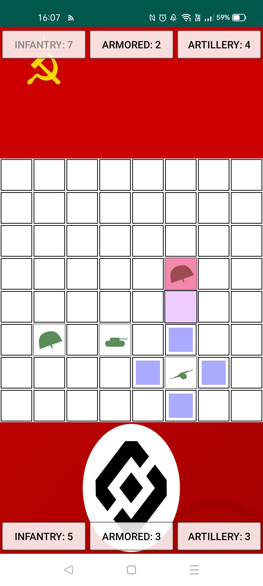 
    </td>
    <td>
      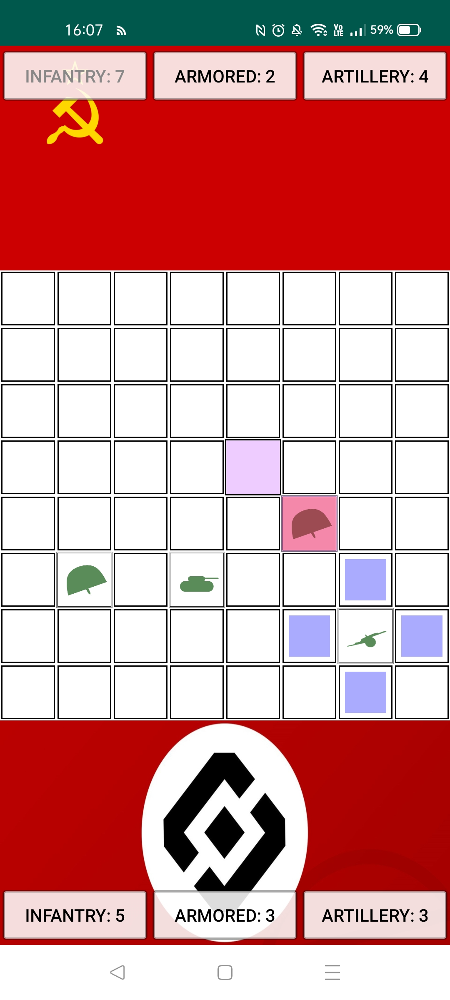 
    </td>
  </tr>
</table>

### Attack mechanics
There are to different types of attack in game  
* Soft Attack  
Is used to destroy Infantry
* Hard Attack
Is used to destoy Armored and Artillery  

Infantry division has very little Hard Attack, but much Soft Attack, so is best used against another Infantry division

Armored divisions has much Hard Attack and a little less soft Attack, it is suited for everything

Artillery division has the same Soft and Hard attack stats as Armored
